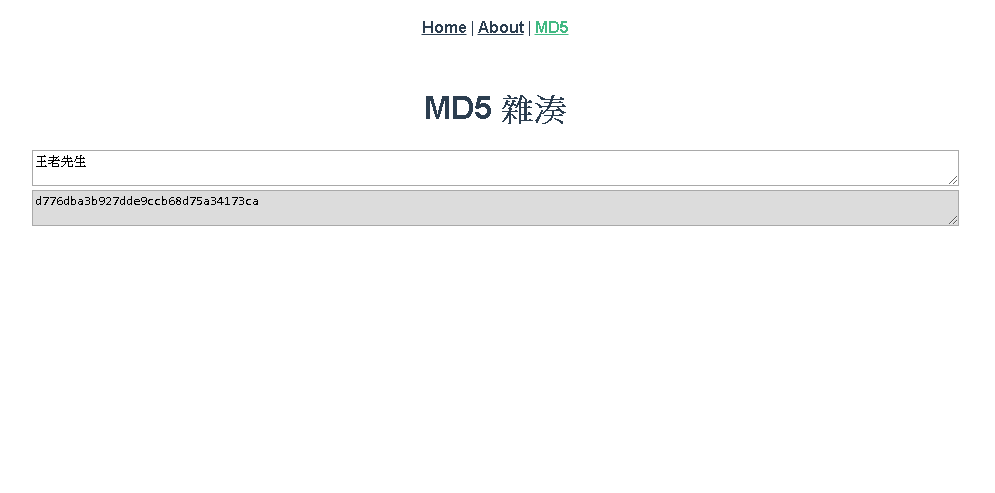

# [:octocat:TcTools](https://github.com/TCCinTaiwan/TcTools)
[](https://travis-ci.org/TCCinTaiwan/TcTools)

## Demo[↶](#)

See [Github Pages](https://tccintaiwan.github.io/TcTools/#/).



## Installation[↶](#)

```bash
# 複製專案
git clone https://github.com/TCCinTaiwan/TcTools

# 切換到 Vue 資料夾
cd TcTools/vue

# 設定環境為開發環境，不然路徑會錯誤(多了 TcTools)
set NODE_ENV=development

# 安裝依賴套件
npm install

# 建置環境
npm run build

# 跑網頁，這邊使用 live-server 直接用 npm 安裝即可
live-server dist\
```
